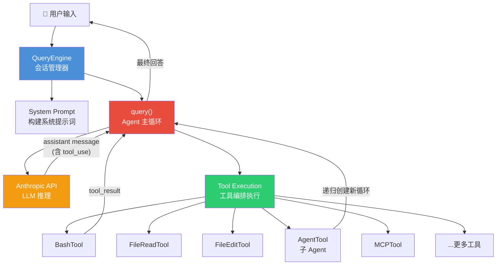
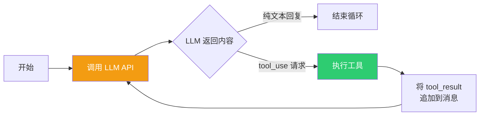
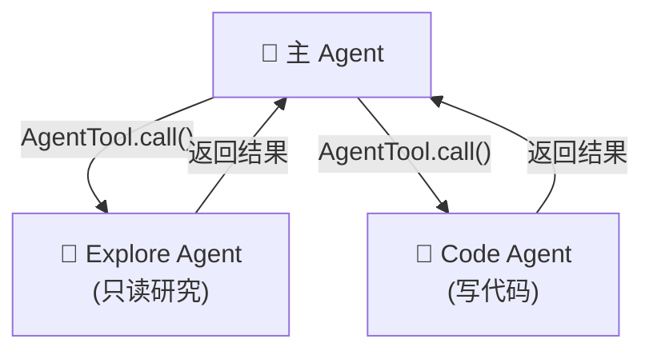
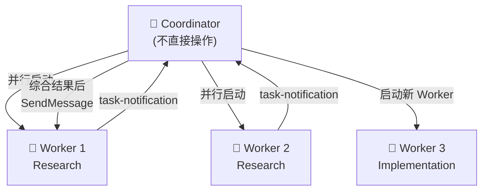
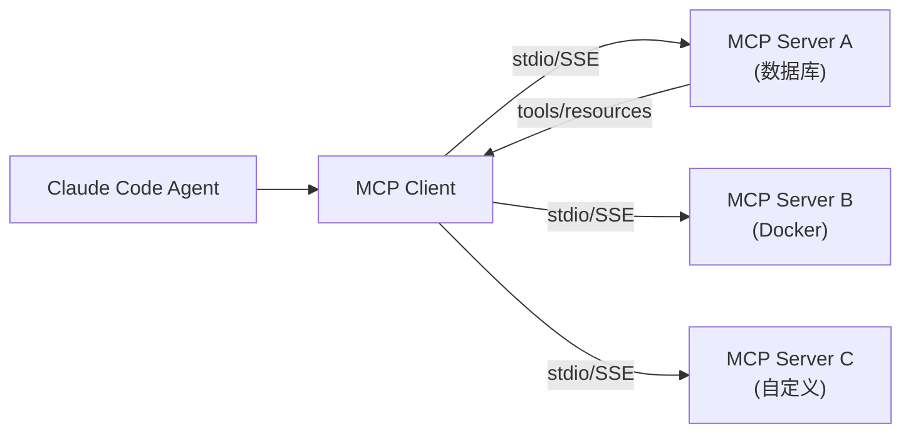

# Claude Code 核心架构深度分析

> [!NOTE]
> 本文档是对 Claude Code 泄露源码的核心架构分析，目标是提炼出可复用于 **Router Test Agent** 的关键设计模式。
> 项目规模：~1,900 文件，512,000+ 行 TypeScript 代码。

---

## 一、总体架构概览

Claude Code 本质上是一个 **Agentic Loop（智能体循环）** 系统。其核心运行机制可以用一句话概括：

> **用户输入 → LLM 推理 → Tool 调用 → 结果反馈给 LLM → 继续推理 → ... → 最终回答用户**

这个 "推理-行动" 循环就是整个系统的心脏。

### 核心数据流



---

## 二、六大核心子系统

### 子系统 1：QueryEngine — 会话生命周期管理器

**文件**: [QueryEngine.ts](file:///d:/MyProjects/claude-code/src/QueryEngine.ts) (~1,296 行)

**职责**: 管理一个完整对话的生命周期，包括消息历史、上下文构建、使用量追踪等。

**核心类结构**:

```typescript
class QueryEngine {
    private config: QueryEngineConfig      // 不可变配置
    private mutableMessages: Message[]     // 可变消息历史
    private abortController: AbortController
    private totalUsage: NonNullableUsage   // Token 使用量追踪

    // 每次用户提交消息时调用，返回异步流式消息
    async* submitMessage(prompt): AsyncGenerator<SDKMessage> {
        // 1. 构建 System Prompt（含 CLAUDE.md 记忆、git 状态等上下文）
        // 2. 处理用户输入（解析斜杠命令等）
        // 3. 调用 query() 进入 Agent 主循环
        // 4. 流式 yield 每个消息给调用者
    }
}
```

**关键设计**:

- **AsyncGenerator 模式**: `submitMessage` 返回 `AsyncGenerator<SDKMessage>`，实现流式输出
- **会话隔离**: 一个 `QueryEngine` 对应一个对话，状态在多个 turn 之间持久化
- **上下文组装**: System Prompt 由多个来源动态组装（默认提示 + CLAUDE.md + 用户追加 + 环境上下文）

### 子系统 2：query() — Agent 主循环（最核心）

**文件**: [query.ts](file:///d:/MyProjects/claude-code/src/query.ts) (~1,730 行)

这是整个系统 **最核心** 的函数。它实现了经典的 **ReAct（Reason + Act）循环**：



**核心循环伪代码**:

```typescript
async function* query(params: QueryParams) {
    while (true) {
        // 1. 预处理：上下文压缩、Token 预算检查
        // 2. 调用 LLM API（流式）
        for await (const message of callModel({...})) {
            yield message  // 流式转发给外层

            if (message.type === 'assistant') {
                // 收集 assistant 消息中的 tool_use 块
                for (block of message.content) {
                    if (block.type === 'tool_use') {
                        toolUseBlocks.push(block)
                        needsFollowUp = true
                    }
                }
            }
        }

        // 3. 如果没有工具调用，循环结束
        if (!needsFollowUp) return

        // 4. 并行/串行执行所有工具
        const results = await runTools(toolUseBlocks, ...)

        // 5. 将 tool_result 追加到消息历史
        messages.push(...results)

        // 6. 继续循环 → 回到步骤 2
    }
}
```

**关键设计要点**:

| 特性           | 实现方式                           |
|--------------|--------------------------------|
| **流式输出**     | `AsyncGenerator` + `yield*` 委托 |
| **自动压缩**     | 上下文过长时自动触发 autocompact         |
| **Token 预算** | `tokenBudget` 机制控制总消耗          |
| **最大轮次**     | `maxTurns` 参数防止无限循环            |
| **错误恢复**     | prompt_too_long 时自动压缩重试        |
| **回退模型**     | 流式失败时自动切换 fallback model       |

### 子系统 3：Tool 系统 — 能力抽象层

**文件**: [Tool.ts](file:///d:/MyProjects/claude-code/src/Tool.ts) (~793 行) + [tools.ts](file:///d:/MyProjects/claude-code/src/tools.ts) (~390 行)

这是 Agent 的 **"手和脚"**。每个 Tool 都是一个标准化的能力模块。

**Tool 接口核心定义**:

```typescript
type Tool<Input, Output, Progress> = {
    name: string                    // 工具名称
    inputSchema: ZodSchema          // 输入参数 schema（Zod 定义）

    // 核心方法
    call(args, context, canUseTool, parentMessage, onProgress)
        : Promise<ToolResult<Output>>   // 执行工具

    prompt(options): Promise<string>  // 生成系统提示词中该工具的描述

    // 权限与验证
    checkPermissions(input, context): Promise<PermissionResult>
    validateInput?(input, context): Promise<ValidationResult>

    // 属性声明
    isConcurrencySafe(input): boolean  // 是否可并发
    isReadOnly(input): boolean         // 是否只读
    isDestructive?(input): boolean     // 是否破坏性操作
    isEnabled(): boolean               // 是否启用

    // UI 渲染（CLI 展示用，我们可忽略）
    renderToolUseMessage(...)
    renderToolResultMessage?(...)
}
```

**Tool 注册机制** — `tools.ts` 中的 `getAllBaseTools()`:

```typescript
function getAllBaseTools(): Tools {
    return [
        AgentTool,      // 子 Agent 生成
        BashTool,       // Shell 命令执行
        FileReadTool,   // 文件读取
        FileEditTool,   // 文件编辑
        FileWriteTool,  // 文件写入
        GlobTool,       // 文件搜索
        GrepTool,       // 内容搜索
        WebFetchTool,   // 网页抓取
        WebSearchTool,  // 网页搜索
        SkillTool,      // 技能执行
        // ... 更多工具
    ]
}
```

**`buildTool()` 工厂函数** — 用安全默认值填充工具定义：

```typescript
function buildTool(def: ToolDef): Tool {
    return {
        isEnabled: () => true,
        isConcurrencySafe: () => false,   // 默认不可并发
        isReadOnly: () => false,           // 默认有写操作
        isDestructive: () => false,
        checkPermissions: (input) =>
            Promise.resolve({behavior: 'allow', updatedInput: input}),
        ...def,  // 用户自定义覆盖
    }
}
```

### 子系统 4：AgentTool + Coordinator — 多 Agent 协作

**文件**:

- [AgentTool/runAgent.ts](file:///d:/MyProjects/claude-code/src/tools/AgentTool/runAgent.ts) (~974 行)
- [coordinator/coordinatorMode.ts](file:///d:/MyProjects/claude-code/src/coordinator/coordinatorMode.ts) (~370 行)

这是 Claude Code 实现 **Agent Swarm**（多 Agent 协作）的核心。

**两种多 Agent 模式**:

#### 模式 A：普通子 Agent（默认）

主 Agent 通过 `AgentTool` 生成子 Agent，子 Agent 完成任务后返回结果给主 Agent：



#### 模式 B：Coordinator 模式（高级）

主 Agent 变成 Coordinator（协调者），只负责任务分发和结果综合：



**`runAgent()` 的关键逻辑**:

```typescript
async function* runAgent({agentDefinition, promptMessages, ...}) {
    // 1. 确定 Agent 使用的模型
    const resolvedAgentModel = getAgentModel(...)

    // 2. 为 Agent 创建隔离上下文
    const agentToolUseContext = createSubagentContext(parentContext, {
        agentId,
        messages: initialMessages,      // 独立消息历史
        readFileState: agentReadFileState,  // 独立文件缓存
        abortController: isAsync
            ? new AbortController()       // 异步 Agent 有独立取消控制
            : parentAbortController,      // 同步 Agent 共享父级
    })

    // 3. 构建 Agent 专属系统提示词
    const agentSystemPrompt = await getAgentSystemPrompt(agentDefinition, ...)

    // 4. 递归调用 query() — 子 Agent 有自己的推理循环！
    for await (const message of query({
        messages: initialMessages,
        systemPrompt: agentSystemPrompt,
        tools: resolvedTools,           // Agent 可用工具子集
        maxTurns: agentDefinition.maxTurns,
    })) {
        yield message
    }
}
```

### 子系统 5：Context 系统 — 上下文注入

**文件**: [context.ts](file:///d:/MyProjects/claude-code/src/context.ts) (~190 行)

上下文分为三层注入到每次 API 调用中：

```
┌─────────────────────────────────────────┐
│ System Prompt (系统提示词)                │
│  ├─ 默认系统提示（角色定义、行为规范）      │
│  ├─ CLAUDE.md（项目级记忆）               │
│  └─ appendSystemPrompt（用户追加）         │
├─────────────────────────────────────────┤
│ User Context (用户上下文) — 每轮首条消息    │
│  ├─ claudeMd: CLAUDE.md 内容              │
│  ├─ currentDate: 当前日期                  │
│  └─ workerToolsContext: Worker 可用工具     │
├─────────────────────────────────────────┤
│ System Context (系统上下文) — 追加到系统提示 │
│  └─ gitStatus: Git 仓库状态快照            │
└─────────────────────────────────────────┘
```

### 子系统 6：MCP 与外部集成

**文件**: [services/mcp/](file:///d:/MyProjects/claude-code/src/services/mcp/) (~23 个文件)

MCP (Model Context Protocol) 是 Claude Code 的 **外部工具扩展机制**。通过 MCP，可以将任意外部服务的能力以标准化 Tool 的形式注入到 Agent 中。



---

## 三、核心设计模式提炼

### 模式 1：Tool-Use Loop（工具使用循环）

- LLM 返回 `tool_use` 块 → 系统执行工具 → `tool_result` 反馈给 LLM → 循环
- 这是整个 Agent 的 **心脏**

### 模式 2：Schema-Driven Tool（Schema 驱动的工具）

- 每个 Tool 用 Zod Schema 定义输入参数
- LLM 按 Schema 生成参数，系统自动验证
- 工具描述（prompt）注入到系统提示词中

### 模式 3：Context Injection（上下文注入）

- 系统提示词 = 静态规则 + 动态上下文（环境信息、项目配置）
- 上下文在每次 API 调用前动态组装

### 模式 4：Recursive Agent（递归 Agent）

- AgentTool 内部递归调用 `query()`
- 子 Agent 有独立的消息历史、工具集、系统提示词
- 支持同步/异步两种执行模式

### 模式 5：Permission Guard（权限守卫）

- 每个工具调用前经过 `checkPermissions()` 检查
- 支持多种权限模式：default / plan / auto / bypassPermissions

### 模式 6：Progressive Context Compression（渐进式上下文压缩）

- 对话过长时自动触发 autocompact
- 保留关键信息，压缩历史细节
- 确保 Agent 能在长对话中持续工作
