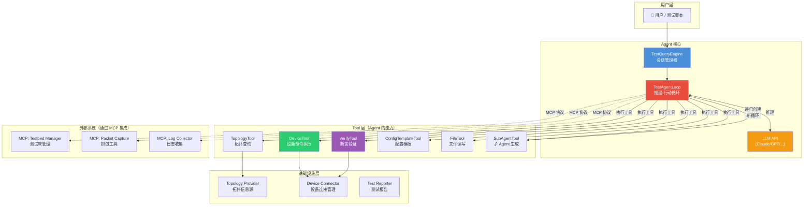
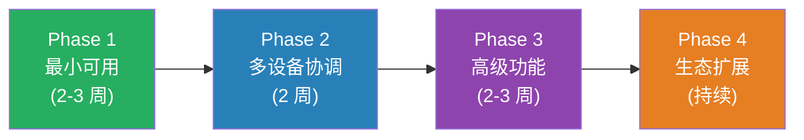

# Router Test Agent 架构设计方案

> [!IMPORTANT]
> 本文档基于 Claude Code 源码分析提炼的核心设计模式，设计一套路由器测试领域的 **Test Agent** 系统架构。
> Test Agent 是一个高权限 Agent，可以根据用户需求对复杂组网拓扑中的路由器设备进行自由配置和测试验证。

---

## 一、系统定位与核心能力

### Test Agent 要做什么？

| 能力        | 说明                       | 对应 Claude Code      |
|-----------|--------------------------|---------------------|
| **设备配置**  | 向路由器下发 CLI 配置命令          | BashTool            |
| **状态查询**  | 查询路由表、接口状态、协议邻居等         | FileReadTool        |
| **拓扑感知**  | 理解组网拓扑、设备互联关系            | Context 注入          |
| **验证断言**  | 自动验证配置是否生效（路由是否学到、流量是否通） | GrepTool + 自定义      |
| **多设备协调** | 同时操作多台设备完成端到端测试          | AgentTool (子 Agent) |
| **测试编排**  | 按用例步骤执行复杂测试流程            | Coordinator 模式      |

### 使用场景示例

```
用户: "请在 R1 和 R2 之间配置 OSPF 邻居关系，area 0，并验证邻居建立成功"

Test Agent 应该:
1. 查询拓扑 → 理解 R1-R2 互联接口
2. 在 R1 上配置 OSPF → router ospf 1, network ...
3. 在 R2 上配置 OSPF → router ospf 1, network ...
4. 等待收敛 → 适当等待
5. 验证 → display ospf peer → 检查 Full 状态
6. 报告结果给用户
```

---

## 二、系统总体架构



---

## 三、七大核心模块设计

### 模块 1：TestQueryEngine（会话管理器）

**对应 Claude Code**: `QueryEngine.ts`

```python
# 技术选型建议: Python (与网络测试生态兼容)

class TestQueryEngine:
    """管理一次完整的测试对话生命周期"""

    def __init__(self, config: TestEngineConfig):
        self.config = config
        self.messages: list[Message] = []
        self.topology: TopologyGraph = None  # 拓扑信息
        self.device_sessions: dict = {}  # 设备连接池
        self.usage_tracker = UsageTracker()

    async def submit_message(self, prompt: str) -> AsyncIterator[AgentMessage]:
        """用户提交测试指令"""
        # 1. 构建系统提示词（含拓扑上下文）
        system_prompt = await self.build_system_prompt()

        # 2. 处理用户输入
        user_message = self.process_input(prompt)
        self.messages.append(user_message)

        # 3. 进入 Agent 主循环
        async for msg in test_agent_loop(
            messages=self.messages,
            system_prompt=system_prompt,
            tools=self.config.tools,
            topology=self.topology,
        ):
            yield msg
```

**关键点**:

- 管理 **设备连接池**（DeviceSession），避免重复登录
- 持有 **拓扑信息**，供所有 Tool 访问
- 追踪 Token 使用量和测试执行时间

### 模块 2：TestAgentLoop（Agent 主循环 — 最核心）

**对应 Claude Code**: `query.ts` 中的 `query()` 函数

```python
async def test_agent_loop(
    messages: list[Message],
    system_prompt: str,
    tools: list[Tool],
    topology: TopologyGraph,
    max_turns: int = 30,
) -> AsyncIterator[Message]:
    """
    核心推理-行动循环
    
    这是整个系统的心脏。
    LLM 推理 → 工具调用 → 结果反馈 → 继续推理 → ...
    """
    turn_count = 0

    while turn_count < max_turns:
        turn_count += 1

        # ===== 步骤 1: 调用 LLM =====
        response = await call_llm(
            messages=messages,
            system_prompt=system_prompt,
            tools=[t.to_schema() for t in tools],  # Tool Schema 列表
        )

        # ===== 步骤 2: 解析 LLM 响应 =====
        assistant_msg = parse_response(response)
        messages.append(assistant_msg)
        yield assistant_msg  # 流式输出给用户

        # ===== 步骤 3: 提取 tool_use 块 =====
        tool_calls = extract_tool_calls(assistant_msg)

        if not tool_calls:
            # 没有工具调用，LLM 直接回复了用户 → 循环结束
            return

        # ===== 步骤 4: 执行工具 =====
        tool_results = await execute_tools(tool_calls, tools, topology)

        # ===== 步骤 5: 将结果追加到消息 =====
        for result in tool_results:
            messages.append(result)
            yield result

        # ===== 继续循环 → 回到步骤 1 =====
```

**关键点**:

- `max_turns` 防止无限循环
- 工具并发执行（可并发的工具同时跑）
- 每轮循环都 `yield` 消息，支持流式 UI 展示

### 模块 3：Tool 系统 — 标准化能力接口

**对应 Claude Code**: `Tool.ts` 中的 `Tool` 接口

```python
from abc import ABC, abstractmethod
from pydantic import BaseModel


class Tool(ABC):
    """所有工具的基类 — 统一的能力抽象"""

    @property
    @abstractmethod
    def name(self) -> str:
        """工具名称，LLM 通过此名称调用"""
        pass

    @property
    @abstractmethod
    def description(self) -> str:
        """工具描述，注入到系统提示词中"""
        pass

    @property
    @abstractmethod
    def input_schema(self) -> type[BaseModel]:
        """输入参数 Schema（Pydantic 模型）"""
        pass

    @abstractmethod
    async def execute(
        self,
        args: BaseModel,
        context: ToolContext,
    ) -> ToolResult:
        """执行工具"""
        pass

    def is_concurrent_safe(self, args) -> bool:
        """是否可以与其他工具并发执行"""
        return False

    def is_read_only(self, args) -> bool:
        """是否为只读操作"""
        return False


class ToolResult:
    """工具执行结果"""
    success: bool
    data: Any  # 结构化结果
    display_text: str  # 给用户展示的文本
    error: str | None  # 错误信息
```

### 模块 4：核心 Tool 实现

#### 4.1 DeviceTool — 设备命令执行（最重要）

**对应 Claude Code**: `BashTool`

```python
class DeviceToolInput(BaseModel):
    device_name: str  # 设备名称，如 "R1"
    command: str  # 要执行的命令
    mode: str = "exec"  # exec / config / config-if / ...
    timeout_ms: int = 30000  # 超时时间


class DeviceTool(Tool):
    name = "device_command"
    description = """
    在指定路由器设备上执行 CLI 命令并返回输出。
    
    ## 使用方式
    - device_name: 拓扑中的设备名称（如 R1, R2, SW1）
    - command: 要执行的命令
    - mode: 命令执行模式
      - "exec": 特权模式（display/show 类查询）
      - "config": 系统视图配置
      - "config-if:GE0/0/1": 接口视图配置
      - "config-ospf:1": OSPF 进程视图
    
    ## 注意事项
    - 配置命令请先查询当前配置，避免冲突
    - 多条配置命令可以用换行分隔，一次性下发
    - 查询命令建议使用 display 而非 show（华为设备）
    """
    input_schema = DeviceToolInput

    async def execute(self, args, context) -> ToolResult:
        device = context.topology.get_device(args.device_name)
        session = await context.get_device_session(device)
        output = await session.send_command(
            args.command,
            mode=args.mode,
            timeout=args.timeout_ms
        )
        return ToolResult(success=True, data=output, display_text=output)

    def is_concurrent_safe(self, args) -> bool:
        return True  # 不同设备可以并发

    def is_read_only(self, args) -> bool:
        return args.mode == "exec"
```

#### 4.2 TopologyTool — 拓扑查询

```python
class TopologyTool(Tool):
    name = "topology_query"
    description = """
    查询测试拓扑信息。可以查询：
    - 所有设备列表
    - 设备间的互联关系（哪个接口连哪个接口）
    - 设备的管理地址
    - 特定设备的详细信息
    """

    async def execute(self, args, context) -> ToolResult:
        # 查询拓扑图，返回结构化信息
        ...

    def is_read_only(self, args) -> bool:
        return True  # 拓扑查询永远是只读的
```

#### 4.3 VerifyTool — 断言验证

```python
class VerifyToolInput(BaseModel):
    device_name: str
    command: str  # 查询命令
    assertion: str  # 断言表达式
    retry_count: int = 3  # 重试次数（协议收敛需要时间）
    retry_interval_s: int = 5


class VerifyTool(Tool):
    name = "verify"
    description = """
    在设备上执行查询命令，并对输出进行断言验证。
    
    assertion 语法示例：
    - "contains: Full"          → 输出中包含 "Full"
    - "not_contains: Down"      → 输出中不包含 "Down"
    - "regex: OSPF.*Full"       → 正则匹配
    - "count: Established >= 2" → 匹配行数 >= 2
    - "json_path: $.result[0].state == 'Up'" → JSON 路径断言
    
    支持重试机制，适用于需要等待协议收敛的场景。
    """

    async def execute(self, args, context) -> ToolResult:
        for attempt in range(args.retry_count):
            output = await send_command(args.device_name, args.command)
            result = evaluate_assertion(output, args.assertion)
            if result.passed:
                return ToolResult(success=True, ...)
            await asyncio.sleep(args.retry_interval_s)
        return ToolResult(success=False, error="断言在重试后仍失败", ...)
```

#### 4.4 ConfigTemplateTool — 配置模板

```python
class ConfigTemplateTool(Tool):
    name = "config_template"
    description = """
    使用预定义的配置模板快速生成配置片段。
    
    可用模板：
    - ospf_basic: 基础 OSPF 配置
    - bgp_peer: BGP 邻居配置
    - vlan_interface: VLAN 接口配置
    - static_route: 静态路由配置
    - acl_basic: 基础 ACL 配置
    
    模板输出纯文本配置，可以直接通过 device_command 工具下发。
    """
```

### 模块 5：Sub-Agent 系统 — 多设备协调

**对应 Claude Code**: `AgentTool` + `runAgent()`

```python
class SubAgentTool(Tool):
    name = "sub_agent"
    description = """
    生成一个子 Agent 来处理复杂的子任务。
    
    子 Agent 拥有完整的工具访问权限，可以独立执行多步骤操作。
    适用于:
    - 需要操作多台设备的端到端测试
    - 复杂配置序列
    - 并行执行多个独立验证任务
    """

    async def execute(self, args, context) -> ToolResult:
        # 为子 Agent 创建独立的上下文
        sub_context = create_sub_context(
            parent_context=context,
            sub_agent_type=args.agent_type,
        )

        # 递归调用 Agent 循环
        result_messages = []
        async for msg in test_agent_loop(
            messages=[create_user_message(args.prompt)],
            system_prompt=get_sub_agent_prompt(args.agent_type),
            tools=resolve_sub_agent_tools(args.agent_type),
            topology=context.topology,
            max_turns=args.max_turns or 20,
        ):
            result_messages.append(msg)

        # 返回子 Agent 的最终结果
        return ToolResult(
            success=True,
            data=extract_final_response(result_messages),
        )
```

**预定义子 Agent 类型**:

| 类型                   | 用途   | 可用工具                         |
|----------------------|------|------------------------------|
| `config_agent`       | 配置下发 | DeviceTool, ConfigTemplate   |
| `verify_agent`       | 验证检查 | DeviceTool, VerifyTool       |
| `research_agent`     | 状态研究 | DeviceTool(只读), TopologyTool |
| `troubleshoot_agent` | 故障排查 | 全部工具                         |

### 模块 6：Context 注入 — 拓扑感知

**对应 Claude Code**: `context.ts`

```python
async def build_system_prompt(topology: TopologyGraph, test_config: dict) -> str:
    """
    组装系统提示词 = 角色定义 + 拓扑上下文 + 设备能力 + 行为规范
    """
    parts = []

    # Part 1: 角色定义
    parts.append(ROLE_PROMPT)  # "你是一个路由器测试专家 Agent..."

    # Part 2: 拓扑上下文（动态注入）
    parts.append(format_topology_context(topology))
    # 输出示例:
    # """
    # 当前测试拓扑:
    # 设备列表: R1(NE40E), R2(NE40E), SW1(S5700)
    # 互联关系:
    #   R1 GE0/0/1 ---- GE0/0/1 R2  (10.1.1.0/30)
    #   R1 GE0/0/2 ---- GE0/0/1 SW1 (192.168.1.0/24)
    # """

    # Part 3: 设备能力描述
    parts.append(get_device_capabilities(topology))
    # "R1 和 R2 是华为 NE40E，支持 OSPF/BGP/MPLS/..."

    # Part 4: 测试规范
    parts.append(TEST_BEST_PRACTICES)
    # "执行配置前先备份、验证时使用重试机制、..."

    return "\n\n".join(parts)
```

### 模块 7：MCP 集成 — 外部系统扩展

**对应 Claude Code**: `services/mcp/`

```python
# 通过 MCP 可以动态接入外部测试工具，无需修改 Agent 核心代码

# 示例 MCP Server：测试床管理
class TestbedMCPServer:
    tools = [
        "reserve_testbed",  # 预留测试床
        "release_testbed",  # 释放测试床
        "get_testbed_status",  # 查询测试床状态
    ]


# 示例 MCP Server：抓包
class PacketCaptureMCPServer:
    tools = [
        "start_capture",  # 开始抓包
        "stop_capture",  # 停止抓包
        "analyze_pcap",  # 分析报文
    ]


# 示例 MCP Server：日志收集
class LogCollectorMCPServer:
    tools = [
        "collect_logs",  # 收集设备日志
        "search_logs",  # 搜索日志关键字
    ]
```

---

## 四、架构映射对照表

| Claude Code 组件 | Router Test Agent 对应    | 核心差异                       |
|----------------|-------------------------|----------------------------|
| `QueryEngine`  | `TestQueryEngine`       | 增加拓扑管理 + 设备连接池             |
| `query()` 循环   | `test_agent_loop()`     | 完全对应，直接复用模式                |
| `Tool` 接口      | `Tool` 基类               | Pydantic 替代 Zod Schema     |
| `BashTool`     | `DeviceTool`            | Shell → Netconf/SSH/Telnet |
| `FileReadTool` | `TopologyTool`          | 文件读取 → 拓扑查询                |
| `GrepTool`     | `VerifyTool`            | 文本搜索 → 断言验证                |
| `AgentTool`    | `SubAgentTool`          | 同模式，子 Agent 面向多设备协调        |
| `context.ts`   | `build_system_prompt()` | git 状态 → 拓扑信息              |
| MCP 服务         | MCP 服务                  | 完全一致，接入测试领域工具              |
| `commands.ts`  | 可选实现                    | 斜杠命令（非核心）                  |
| Coordinator    | `TestCoordinator`       | 测试用例编排                     |
| Permission 系统  | 暂不需要                    | 高权限 Agent 无需权限检查           |

---

## 五、分阶段实施路线



### Phase 1：最小可用 Agent（核心循环）

- [ ] `TestAgentLoop` — 实现 ReAct 循环
- [ ] `Tool` 基类 + `ToolRegistry`
- [ ] `DeviceTool` — 单设备命令执行
- [ ] `TopologyTool` — 拓扑查询
- [ ] `TestQueryEngine` — 基础会话管理
- [ ] 系统提示词 + 拓扑上下文注入
- [ ] **目标**: 能通过对话完成单设备配置和查询

### Phase 2：多设备协调

- [ ] `VerifyTool` — 带重试的断言验证
- [ ] `SubAgentTool` — 子 Agent 生成
- [ ] 并发工具执行
- [ ] `ConfigTemplateTool` — 配置模板
- [ ] **目标**: 能完成多设备端到端测试

### Phase 3：高级功能

- [ ] Coordinator 模式 — 测试用例编排
- [ ] 上下文压缩 — 长对话支持
- [ ] 测试报告生成
- [ ] 测试用例记忆（CLAUDE.md 模式）
- [ ] **目标**: 能编排复杂测试场景

### Phase 4：生态扩展

- [ ] MCP 集成 — 接入抓包、日志等外部工具
- [ ] 自定义 Agent 类型
- [ ] 测试用例库 + Skill 系统
- [ ] **目标**: 可扩展的测试平台

---

## 六、技术选型建议

| 层次            | 推荐技术                   | 理由                               |
|---------------|------------------------|----------------------------------|
| **语言**        | Python 3.11+           | 网络测试生态最佳（Netmiko/Nornir/Scrapli） |
| **LLM SDK**   | `anthropic` / `openai` | 按实际模型选择                          |
| **Schema 验证** | Pydantic v2            | Python 生态标准，替代 Zod               |
| **异步框架**      | asyncio + aiohttp      | 并发设备操作                           |
| **设备连接**      | Netmiko / Scrapli      | SSH/Telnet 连接管理                  |
| **拓扑描述**      | YAML / JSON            | 声明式拓扑定义                          |
| **MCP SDK**   | `mcp` (官方 Python SDK)  | 外部工具集成                           |
| **测试报告**      | Jinja2 模板              | 生成 HTML/Markdown 报告              |

> [!TIP]
> **核心原则**: 先把 Phase 1 的最小循环跑通，这是整个系统的基石。一旦 `TestAgentLoop` + `DeviceTool` 能工作，后续所有功能都是在这个骨架上添加 Tool 和上下文。
