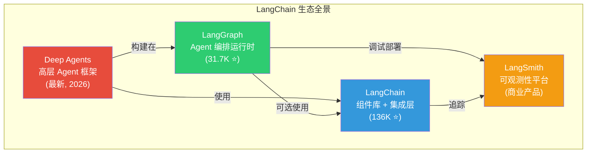
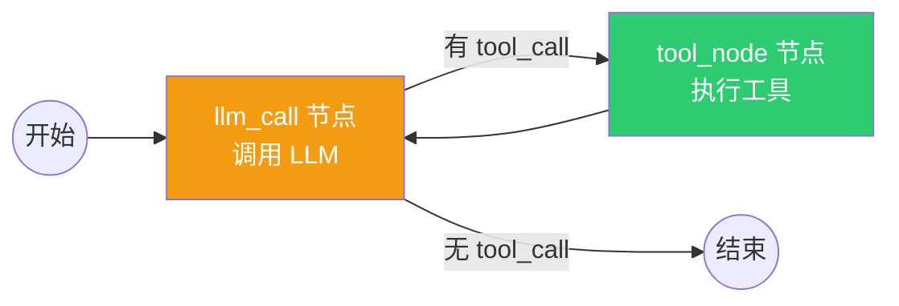

# LangChain / LangGraph 技术评估报告（上）

> **评估目标**: 判断 Router Test Agent 是否应该采用 LangChain / LangGraph
> **评估日期**: 2026-05-11
> **结论预告**: ⚠️ **推荐采用 LangGraph，但不推荐 LangChain**

---

## 一、技术全景：LangChain 生态到底是什么？

很多人把 LangChain 和 LangGraph 混为一谈，但它们是 **完全不同层次** 的东西：



| 组件              | 定位    | 一句话解释                                           |
|-----------------|-------|-------------------------------------------------|
| **LangChain**   | 组件库   | LLM 调用、Tool 定义、Prompt 模板、向量存储等的 **集成适配层**       |
| **LangGraph**   | 编排运行时 | 将 Agent 建模为 **状态图（State Graph）**，提供持久化、检查点、人工审批 |
| **Deep Agents** | 高层框架  | 预置了规划、子 Agent、文件系统能力的 **开箱即用 Agent**            |
| **LangSmith**   | 平台服务  | 追踪、评估、部署的 **商业 SaaS 产品**                        |

---

## 二、LangChain 深度分析

### 2.1 LangChain 做了什么？

LangChain 的核心价值是 **统一抽象层**：

```python
# LangChain 的核心：统一的模型接口
from langchain.chat_models import init_chat_model

# 一行代码切换不同 LLM 提供商
model = init_chat_model("openai:gpt-5.4")  # OpenAI
model = init_chat_model("anthropic:claude-4")  # Anthropic
model = init_chat_model("google:gemini-pro")  # Google

# 统一的 Tool 定义
from langchain.tools import tool


@tool
def my_tool(param: str) -> str:
    """Tool description for LLM."""
    return do_something(param)


# 绑定工具到模型
model_with_tools = model.bind_tools([my_tool])
```

### 2.2 LangChain 的问题（业界共识）

> [!WARNING]
> 以下问题在 2025-2026 年的开发者社区中已形成广泛共识。

**问题 1：过度抽象**

```python
# 直接用 Anthropic SDK（~5 行代码）
import anthropic

client = anthropic.Client()
response = client.messages.create(
    model="claude-4", messages=[...], tools=[...]
)

# 用 LangChain（需要理解 Chain, Runnable, BaseMessage, 
# ChatPromptTemplate, RunnablePassthrough, RunnableLambda...）
# 同样的功能，需要理解 10+ 个抽象概念
```

**问题 2：依赖膨胀**

- 安装 `langchain` 会拉入大量传递依赖
- 对于我们只需要操作路由器的场景，99% 的集成都用不到

**问题 3：API 频繁变更**

- 从 v0.1 到 v0.3 经历了多次破坏性变更
- 生产环境中需要严格锁版本

**问题 4：调试困难**

- 错误堆栈被多层抽象包裹，难以定位真实问题
- 对于网络设备操作这种需要精确控制的场景，这是致命的

### 2.3 LangChain 对 Test Agent 的评估

| 评估维度    | 评分      | 说明                                 |
|---------|---------|------------------------------------|
| 模型抽象层   | ⭐⭐⭐     | 有价值，但我们短期只用一个 LLM，直接用 SDK 更简单      |
| Tool 定义 | ⭐⭐      | `@tool` 装饰器方便但不灵活，不如 Pydantic 自定义  |
| 集成生态    | ⭐       | 大量集成（文档加载、向量库）与路由器测试无关             |
| 调试体验    | ⭐       | 多层包装导致调试困难，网络设备操作需要精确控制            |
| 依赖负担    | ⭐       | 引入大量不需要的依赖                         |
| **综合**  | **不推荐** | 对 Test Agent 而言，LangChain 是不必要的抽象层 |

---

## 三、LangGraph 深度分析

### 3.1 LangGraph 的核心思想

LangGraph 将 Agent 建模为一个 **有向状态图**：



这与 Claude Code 的 `query()` 循环本质上是 **同一个模式**，但 LangGraph 用图的形式表达：

```python
# LangGraph 的 ReAct Agent 实现
from langgraph.graph import StateGraph, START, END


# 1. 定义状态
class AgentState(TypedDict):
    messages: Annotated[list, operator.add]


# 2. 定义节点（函数）
def llm_call(state): ...


def tool_node(state): ...


def should_continue(state) -> Literal["tool_node", "__end__"]: ...


# 3. 构建图
graph = StateGraph(AgentState)
graph.add_node("llm_call", llm_call)
graph.add_node("tool_node", tool_node)
graph.add_edge(START, "llm_call")
graph.add_conditional_edges("llm_call", should_continue)
graph.add_edge("tool_node", "llm_call")

# 4. 编译运行
agent = graph.compile()
result = agent.invoke({"messages": [...]})
```

### 3.2 LangGraph 的独特价值

LangGraph 提供了一些我们 **自己实现需要大量工作** 的能力：

#### 能力 1：持久化检查点（Checkpointing）

```python
from langgraph.checkpoint.sqlite import SqliteSaver

# 编译时添加检查点存储
checkpointer = SqliteSaver.from_conn_string("checkpoints.db")
agent = graph.compile(checkpointer=checkpointer)

# 每个状态转换自动保存 → 崩溃后可恢复
agent.invoke(input, config={"configurable": {"thread_id": "test-001"}})
# 如果中途崩溃，重新调用会从最后一个检查点恢复
```

**Test Agent 场景**：一个 OSPF 配置测试可能需要 20+ 轮工具调用，如果中途 Agent 崩溃，检查点能让它从断点恢复，而不是从头重新配置所有设备。

#### 能力 2：Human-in-the-Loop（人工审批）

```python
from langgraph.graph import interrupt


def dangerous_config_node(state):
    # 在下发高危配置前暂停，等人工确认
    approved = interrupt({
        "question": "即将在核心路由器 PE1 上执行 BGP 路由策略变更，是否继续？",
        "pending_config": state["config_to_apply"],
    })
    if approved:
        apply_config(state["config_to_apply"])
```

**Test Agent 场景**：虽然我们说"高权限 Agent"，但某些操作（删除路由表、重启设备）仍可能需要人工确认。LangGraph 的 interrupt 机制天然支持。

#### 能力 3：子图（Subgraph）

```python
# 子图 = 可复用的 Agent 子工作流
ospf_test_subgraph = build_ospf_test_graph()
bgp_test_subgraph = build_bgp_test_graph()

# 主图中嵌入子图
main_graph.add_node("ospf_test", ospf_test_subgraph)
main_graph.add_node("bgp_test", bgp_test_subgraph)
```

**Test Agent 场景**：OSPF 测试流程、BGP 测试流程、MPLS 测试流程可以分别封装为子图，主 Agent 按需调用。

#### 能力 4：Time Travel（时间旅行调试）

```python
# 获取所有历史状态
history = list(agent.get_state_history(config))

# 回到某个历史检查点重新执行
agent.update_state(config, values=old_state)
```

**Test Agent 场景**：测试失败后，可以回退到"配置下发前"的状态重新调试，无需从零开始。

#### 能力 5：流式输出

```python
# 逐步输出每个节点的结果
for chunk in agent.stream(input, stream_mode="updates"):
    print(chunk)  # 实时看到每一步的执行结果
```

### 3.3 LangGraph 的问题

| 问题              | 严重程度 | 说明                                           |
|-----------------|------|----------------------------------------------|
| 学习曲线            | 中    | 需要理解"图编程"思维模式，与传统循环不同                        |
| 与 LangChain 的耦合 | 低    | 官方示例大量使用 LangChain 组件，但实际上 **可以独立使用**        |
| 调试复杂性           | 中    | 图的执行路径比线性循环更难跟踪（LangSmith 可缓解）               |
| 隐式魔法            | 中    | `Annotated[list, operator.add]` 这种状态合并语法需要学习 |
| 版本更新            | 中    | 框架仍在快速迭代，API 可能变化                            |
