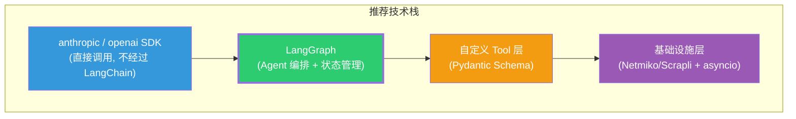

# LangChain / LangGraph 技术评估报告（下）

---

## 四、三方案深度对比

### 方案 A：纯自建（Claude Code 模式）

照搬 Claude Code 的 `query()` 循环，用 Python 从零实现：

```python
# 方案 A：纯手写 ReAct 循环
async def test_agent_loop(messages, tools, max_turns=30):
    for _ in range(max_turns):
        response = await call_llm(messages)
        tool_calls = extract_tool_calls(response)
        if not tool_calls:
            return  # 完成
        results = await execute_tools(tool_calls, tools)
        messages.extend(results)
```

| 维度     | 评价                                         |
|--------|--------------------------------------------|
| ✅ 优点   | 完全控制、零依赖、学习成本最低                            |
| ❌ 缺点   | 检查点恢复要自己写、人工审批要自己写、子 Agent 协调要自己写、流式输出要自己写 |
| 📊 工作量 | 基础循环 1 周，生产级功能 2-3 个月                      |
| 🎯 适用  | 快速验证原型（Phase 1）                            |

### 方案 B：LangGraph（不用 LangChain）

只用 LangGraph 做 Agent 编排，LLM 调用直接用原生 SDK：

```python
# 方案 B：LangGraph + 原生 SDK
from langgraph.graph import StateGraph, START, END
import anthropic  # 直接用原生 SDK


class TestState(TypedDict):
    messages: Annotated[list, add_messages]
    topology: dict
    test_results: list


def llm_node(state):
    client = anthropic.Client()
    response = client.messages.create(...)
    return {"messages": [response]}


def device_tool_node(state):
    # 直接执行设备命令，不经过 LangChain 抽象
    ...


graph = StateGraph(TestState)
graph.add_node("llm", llm_node)
graph.add_node("tools", device_tool_node)
# ... 连接边 ...
agent = graph.compile(checkpointer=SqliteSaver(...))
```

| 维度     | 评价                                       |
|--------|------------------------------------------|
| ✅ 优点   | 检查点、人工审批、子图、流式输出开箱即用；不依赖 LangChain 的过度抽象 |
| ❌ 缺点   | 需要学习图编程范式；框架处于快速迭代期                      |
| 📊 工作量 | 基础 Agent 1-2 周，生产级功能 3-4 周               |
| 🎯 适用  | **推荐方案**                                 |

### 方案 C：LangChain + LangGraph 全家桶

使用完整的 LangChain 生态：

```python
# 方案 C：全家桶
from langchain.chat_models import init_chat_model
from langchain.tools import tool
from langgraph.prebuilt import create_react_agent

model = init_chat_model("anthropic:claude-4")


@tool
def device_command(device: str, cmd: str) -> str:
    """Execute command on router."""
    ...


agent = create_react_agent(model, [device_command])
```

| 维度     | 评价                        |
|--------|---------------------------|
| ✅ 优点   | 代码最少、开箱即用、可快速换模型          |
| ❌ 缺点   | 过度抽象、依赖膨胀、调试困难、Tool 自定义受限 |
| 📊 工作量 | 快速原型 3 天，但遇到定制需求时反而更慢     |
| 🎯 适用  | 快速 Demo 演示                |

### 三方案总评

```mermaid
quadrantChart
    title 三方案定位分析
    x-axis "开发速度 →" 0 --> 100
    y-axis "生产可靠性 →" 0 --> 100
    quadrant-1 "最佳选择"
    quadrant-2 "过度工程"
    quadrant-3 "不足"
    quadrant-4 "快速但脆弱"
    "方案A 纯自建": [30, 45]
    "方案B LangGraph": [65, 80]
    "方案C 全家桶": [80, 50]
```

---

## 五、与 Claude Code 架构的深度对比

Claude Code 是一个成熟的生产级 Agent，但它选择了 **纯自建** 路线。这是否意味着我们也应该自建？

### Claude Code 为什么不用 LangGraph？

| 原因                     | 说明                                       | 是否适用于我们？           |
|------------------------|------------------------------------------|--------------------|
| **TypeScript 生态**      | Claude Code 用 TS 开发，LangGraph 主要是 Python | ❌ 我们用 Python       |
| **Anthropic 自家产品**     | 只需支持自家模型，无需模型抽象层                         | ❌ 我们可能换模型          |
| **51 万行代码的团队**         | 有专职团队维护复杂基础设施                            | ❌ 我们是小团队           |
| **极致定制需求**             | Prompt 缓存、流式工具执行等深度优化                    | ❌ 我们暂不需要           |
| **产品发布时间早于 LangGraph** | Claude Code 起步时 LangGraph 还不成熟           | ❌ 现在 LangGraph 已成熟 |

### Claude Code 自建了什么 = LangGraph 内置了什么

| Claude Code 自建功能       | 代码量      | LangGraph 对应                     |
|------------------------|----------|----------------------------------|
| `query()` 循环 + 状态管理    | ~1,730 行 | `StateGraph` + `compile()`       |
| autocompact 上下文压缩      | ~500 行   | `add_messages` reducer 自带裁剪      |
| AgentTool 子 Agent 递归   | ~974 行   | `Subgraph`                       |
| Coordinator 多 Agent 协调 | ~370 行   | `Subgraph` + `conditional_edges` |
| 消息历史持久化                | ~300 行   | `checkpointer` (一行配置)            |
| 错误恢复 + 重试              | ~200 行   | `fault_tolerance` (内置)           |
| 流式输出                   | ~400 行   | `stream()` / `astream()`         |

> [!IMPORTANT]
> **关键洞察**：Claude Code 团队花了 **~4,500 行代码** 自建的基础设施，在 LangGraph 中大约 **50 行配置** 就能获得。
>
> 这不意味着 LangGraph 更好——Claude Code 的自建实现针对其场景高度优化。但对于我们这个 **从零开始的小团队项目**，复用成熟框架的基础设施是更明智的选择。

---

## 六、Test Agent 业务场景逐项评估

### 场景 1：单设备 OSPF 配置

```
用户: "在 R1 上配置 OSPF area 0"
```

- 需要循环工具调用：✅ LangGraph / 自建都能做
- 需要检查点：❌ 简单操作不需要
- **结论**：两种方案都行

### 场景 2：多设备端到端测试

```
用户: "在 R1-R2-R3 之间建立 OSPF 全互联，验证全通"
```

- 需要并行操作多台设备：✅ LangGraph 子图天然支持
- 需要协调步骤顺序：✅ LangGraph 的条件边更清晰
- 某台设备配置失败需回滚：✅ LangGraph 检查点能回到失败前的状态
- **结论**：**LangGraph 明显优势**

### 场景 3：长时间复杂测试流程

```
用户: "执行 BGP 路由策略全量回归测试"（可能持续 30 分钟+）
```

- 需要持久化（防崩溃丢失进度）：✅ LangGraph 检查点
- 需要中途人工确认：✅ LangGraph interrupt
- 需要查看历史执行轨迹：✅ LangGraph 时间旅行
- **结论**：**LangGraph 显著优势，自建需要大量额外工作**

### 场景 4：高危操作审批

```
Agent 即将执行: "undo router-id" (删除路由器标识)
```

- 需要暂停执行等人工确认：✅ LangGraph `interrupt()` 一行搞定
- 自建需要实现完整的暂停/恢复/超时机制
- **结论**：**LangGraph 显著优势**

### 场景 5：测试失败排查

```
测试员: "刚才第 3 步验证失败了，回到第 2 步看看配置是否正确"
```

- 需要回溯到历史状态：✅ LangGraph 时间旅行
- 自建需要手动序列化/反序列化每一步的状态
- **结论**：**LangGraph 独有优势**

---

## 七、最终结论与建议

### 🏆 推荐方案：LangGraph + 原生 LLM SDK（方案 B）



### 具体建议

| 决策            | 选择                     | 理由                                   |
|---------------|------------------------|--------------------------------------|
| **LLM 调用**    | ✅ 原生 SDK (`anthropic`) | 直接控制、无抽象开销、调试清晰                      |
| **Agent 编排**  | ✅ LangGraph            | 检查点、人工审批、子图、流式输出开箱即用                 |
| **Tool 定义**   | ✅ 自定义 (Pydantic)       | 路由器 Tool 有特殊需求（mode、timeout），需要完全自定义 |
| **LangChain** | ❌ 不使用                  | 过度抽象、不需要其集成生态                        |
| **LangSmith** | ⚠️ 可选                  | 有调试价值但增加外部依赖，初期可不用                   |

### 参考实现骨架

```python
# === Test Agent 推荐技术栈示例 ===
from langgraph.graph import StateGraph, START, END
from langgraph.checkpoint.sqlite import SqliteSaver
from pydantic import BaseModel
import anthropic


# 1. 状态定义（TypedDict + LangGraph reducer）
class TestAgentState(TypedDict):
    messages: Annotated[list, add_messages]
    topology: dict  # 拓扑信息
    test_results: list  # 测试结果


# 2. LLM 节点（直接用原生 SDK）
def llm_node(state: TestAgentState):
    client = anthropic.Client()
    response = client.messages.create(
        model="claude-sonnet-4-6",
        system=build_system_prompt(state["topology"]),
        messages=state["messages"],
        tools=get_tool_schemas(),
    )
    return {"messages": [response]}


# 3. 工具节点（完全自定义）
def tool_node(state: TestAgentState):
    last_msg = state["messages"][-1]
    results = []
    for tool_call in last_msg.tool_calls:
        result = execute_router_tool(tool_call, state["topology"])
        results.append(result)
    return {"messages": results}


# 4. 构建图
graph = StateGraph(TestAgentState)
graph.add_node("llm", llm_node)
graph.add_node("tools", tool_node)
graph.add_edge(START, "llm")
graph.add_conditional_edges("llm", should_continue)
graph.add_edge("tools", "llm")

# 5. 编译（带检查点！）
checkpointer = SqliteSaver.from_conn_string("test_sessions.db")
test_agent = graph.compile(checkpointer=checkpointer)

# 6. 运行
result = test_agent.invoke(
    {"messages": [{"role": "user", "content": "配置 R1-R2 OSPF"}]},
    config={"configurable": {"thread_id": "test-session-001"}},
)
```

### 修订后的技术栈

| 层次           | 之前建议              | 修订后建议              | 变更原因              |
|--------------|-------------------|--------------------|-------------------|
| LLM 调用       | `anthropic` SDK   | `anthropic` SDK    | 不变                |
| **Agent 编排** | **自建循环**          | **LangGraph**      | 检查点/审批/子图价值大于学习成本 |
| Schema 验证    | Pydantic v2       | Pydantic v2        | 不变                |
| 异步框架         | asyncio           | asyncio            | 不变                |
| 设备连接         | Netmiko / Scrapli | Netmiko / Scrapli  | 不变                |
| MCP 集成       | `mcp` SDK         | `mcp` SDK          | 不变                |
| **可观测性**     | **无**             | **LangSmith (可选)** | 新增，对调试复杂测试流程有价值   |

> [!TIP]
> **一句话总结**：用 LangGraph 做 Agent 的"骨架"（编排+状态），用原生 SDK 做"肌肉"（LLM 调用），用自定义 Tool 做"手脚"（路由器操作）。不用 LangChain。
