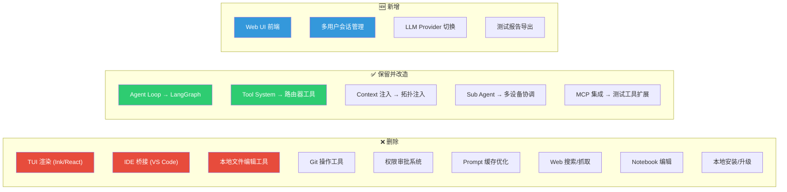
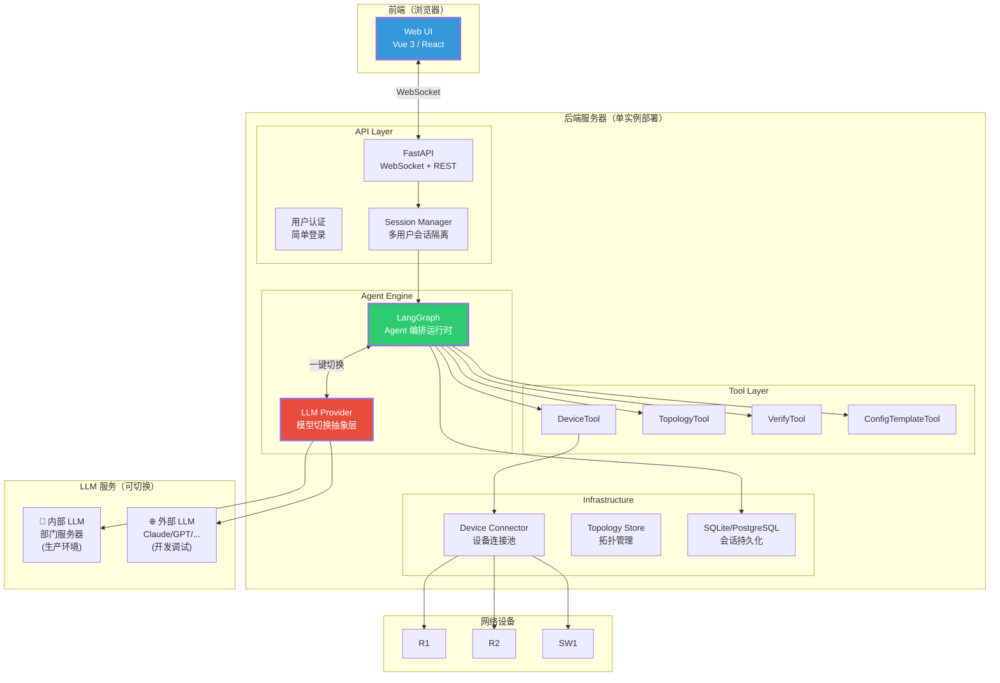

# Test Agent 架构方案 v2（修订版 · 上）

> [!IMPORTANT]
> 本文档是基于用户反馈的 **重大修订**，与 v1 版本有本质区别。
> 三大约束变更：LLM 一键切换、Web UI 多用户部署、大幅精简功能。

---

## 一、架构约束变更

### Claude Code vs Test Agent：本质差异

| 维度         | Claude Code      | Test Agent          |
|------------|------------------|---------------------|
| **部署模式**   | 本地安装，每人一个实例      | 服务器单实例，多用户共享        |
| **交互方式**   | Terminal UI（命令行） | Web UI（浏览器访问）       |
| **LLM 来源** | 固定 Anthropic API | 可切换：内部部署 / 外部 API   |
| **运行环境**   | 用户本机（需 Node.js）  | 公司服务器（登录即用）         |
| **用户画像**   | 开发者（熟悉终端）        | 测试人员（习惯 Web 操作）     |
| **复杂度**    | 51 万行代码          | **目标 < 5000 行核心代码** |

### 从 Claude Code 裁剪掉的功能



---

## 二、系统总体架构



---

## 三、后端架构设计

后端分为 **四层**，每层职责清晰：

### 第 1 层：API Layer（接口层）

```python
# === FastAPI + WebSocket ===
from fastapi import FastAPI, WebSocket

app = FastAPI()


@app.websocket("/ws/chat/{session_id}")
async def chat_websocket(websocket: WebSocket, session_id: str):
    """每个用户的对话通过 WebSocket 实时通信"""
    await websocket.accept()
    session = session_manager.get_or_create(session_id, user_id)

    async for message in websocket.iter_text():
        # 用户发消息 → 转发给 Agent → 流式返回结果
        async for chunk in session.agent.astream(message):
            await websocket.send_json(chunk)


@app.get("/api/sessions")
async def list_sessions(user_id: str):
    """查看用户的历史会话"""
    ...


@app.post("/api/config/llm-provider")
async def switch_llm_provider(provider: str):
    """一键切换 LLM 提供商"""
    ...
```

### 第 2 层：Agent Engine（Agent 引擎）

这是核心——基于 LangGraph 的 Agent 编排：

```python
# === LangGraph Agent 图定义 ===
from langgraph.graph import StateGraph, START, END


class TestAgentState(TypedDict):
    messages: Annotated[list, add_messages]
    topology: dict
    test_results: list[dict]


def build_test_agent(llm_provider, topology):
    """构建 Test Agent 图"""
    graph = StateGraph(TestAgentState)

    # 节点
    graph.add_node("llm", make_llm_node(llm_provider))
    graph.add_node("tools", make_tool_node(topology))

    # 边
    graph.add_edge(START, "llm")
    graph.add_conditional_edges("llm", route_after_llm)
    graph.add_edge("tools", "llm")

    # 编译（带持久化检查点）
    return graph.compile(checkpointer=get_checkpointer())
```

### 第 3 层：LLM Provider 抽象层（关键设计）

> [!IMPORTANT]
> 这是最关键的新增设计：一个 **极简的模型切换层**，不用 LangChain。

```python
from abc import ABC, abstractmethod
from pydantic import BaseModel


# === 统一接口 ===
class LLMProvider(ABC):
    """LLM 提供商抽象接口 — 只有一个方法"""

    @abstractmethod
    async def chat(
        self,
        messages: list[dict],
        system: str,
        tools: list[dict],  # OpenAI/Anthropic 格式的 tool schema
    ) -> LLMResponse:
        pass


class LLMResponse(BaseModel):
    content: str  # 文本回复
    tool_calls: list[ToolCall]  # 工具调用请求
    usage: dict  # token 用量


class ToolCall(BaseModel):
    id: str
    name: str
    arguments: dict


# === 内部 LLM（部门服务器）===
class InternalLLMProvider(LLMProvider):
    """连接部门内部部署的 LLM 服务"""

    def __init__(self, base_url: str, model_name: str, api_key: str = ""):
        self.base_url = base_url  # e.g. "http://10.x.x.x:8000/v1"
        self.model_name = model_name
        self.api_key = api_key

    async def chat(self, messages, system, tools) -> LLMResponse:
        # 大多数内部部署都兼容 OpenAI API 格式
        # (vLLM, TGI, Ollama 等都支持)
        async with httpx.AsyncClient() as client:
            resp = await client.post(
                f"{self.base_url}/chat/completions",
                json={
                    "model": self.model_name,
                    "messages": [{"role": "system", "content": system}] + messages,
                    "tools": tools,
                },
                headers={"Authorization": f"Bearer {self.api_key}"},
            )
        return self._parse_openai_response(resp.json())


# === 外部 LLM（开发调试用）===
class AnthropicProvider(LLMProvider):
    """Anthropic Claude API"""

    def __init__(self, api_key: str, model: str = "claude-sonnet-4-6"):
        self.client = anthropic.AsyncClient(api_key=api_key)
        self.model = model

    async def chat(self, messages, system, tools) -> LLMResponse:
        resp = await self.client.messages.create(
            model=self.model,
            system=system,
            messages=messages,
            tools=self._convert_tools(tools),  # 转换格式
        )
        return self._parse_anthropic_response(resp)


class OpenAIProvider(LLMProvider):
    """OpenAI GPT API"""

    def __init__(self, api_key: str, model: str = "gpt-4o"):
        self.client = openai.AsyncClient(api_key=api_key)
        self.model = model

    async def chat(self, messages, system, tools) -> LLMResponse:
        resp = await self.client.chat.completions.create(
            model=self.model,
            messages=[{"role": "system", "content": system}] + messages,
            tools=tools,
        )
        return self._parse_openai_response(resp)


# === 一键切换 ===
class LLMProviderFactory:
    """工厂模式，根据配置创建对应的 Provider"""

    @staticmethod
    def create(config: dict) -> LLMProvider:
        match config["provider"]:
            case "internal":
                return InternalLLMProvider(
                    base_url=config["base_url"],
                    model_name=config["model"],
                )
            case "anthropic":
                return AnthropicProvider(
                    api_key=config["api_key"],
                    model=config.get("model", "claude-sonnet-4-6"),
                )
            case "openai":
                return OpenAIProvider(
                    api_key=config["api_key"],
                    model=config.get("model", "gpt-4o"),
                )
```

**配置文件实现一键切换**：

```yaml
# config.yaml — 切换只需改这一处
llm:
  provider: "internal"        # ← 改为 "anthropic" 或 "openai" 即可切换

  # 内部部署配置
  internal:
    base_url: "http://10.x.x.x:8000/v1"
    model: "Qwen2.5-72B"

  # 外部 API 配置（开发调试用）
  anthropic:
    api_key: "${ANTHROPIC_API_KEY}"
    model: "claude-sonnet-4-6"

  openai:
    api_key: "${OPENAI_API_KEY}"
    model: "gpt-4o"
```

### 第 4 层：Infrastructure（基础设施）

```python
# 设备连接池（复用 SSH 连接）
class DeviceConnectionPool:
    """管理到路由器的 SSH/Netconf 连接，多用户共享"""
    _pool: dict[str, DeviceSession] = {}
    _lock = asyncio.Lock()

    async def get_session(self, device_name: str) -> DeviceSession:
        async with self._lock:
            if device_name not in self._pool:
                self._pool[device_name] = await self._create_session(device_name)
            return self._pool[device_name]


# 拓扑存储
class TopologyStore:
    """从 YAML/数据库 加载拓扑信息"""

    def load(self, topology_id: str) -> TopologyGraph: ...

    def list_topologies(self) -> list[TopologySummary]: ...
```

---

## 四、前端设计

### 技术选型

| 方案                       | 推荐度   | 理由                         |
|--------------------------|-------|----------------------------|
| **Vue 3 + Element Plus** | ⭐⭐⭐⭐⭐ | 你们部门 TTools 项目已用 Vue，技术栈统一 |
| React + Ant Design       | ⭐⭐⭐   | 生态更大但增加学习成本                |
| 纯 HTML + HTMX            | ⭐⭐    | 最简单但交互体验差                  |

### 核心页面

```
┌────────────────────────────────────────────────┐
│  Test Agent                    [用户: 张三] [退出] │
├──────────┬─────────────────────────────────────┤
│ 会话列表    │  当前会话: OSPF 邻居测试              │
│           │                                     │
│ ● OSPF测试 │  [Agent] 我来帮你配置 OSPF。           │
│   BGP测试  │  首先查询拓扑中 R1-R2 的互联接口...     │
│   MPLS测试 │                                     │
│           │  ┌─ DeviceTool [R1] ──────────┐     │
│           │  │ > display interface brief   │     │
│           │  │ GE0/0/1  10.1.1.1  up  up  │     │
│           │  └────────────────────────────┘     │
│           │                                     │
│ ──────── │  [Agent] R1 的 GE0/0/1 连接 R2。      │
│ 拓扑管理   │  现在开始配置 OSPF...                  │
│ 模型设置   │                                     │
│ 测试报告   │  ┌─ DeviceTool [R1] ──────────┐     │
│           │  │ > ospf 1                    │     │
│           │  │ > area 0                    │     │
│           │  │ > network 10.1.1.0 0.0.0.3  │     │
│           │  └────────────────────────────┘     │
│           │                                     │
│           │  [输入消息...]            [发送]       │
└──────────┴─────────────────────────────────────┘
```
