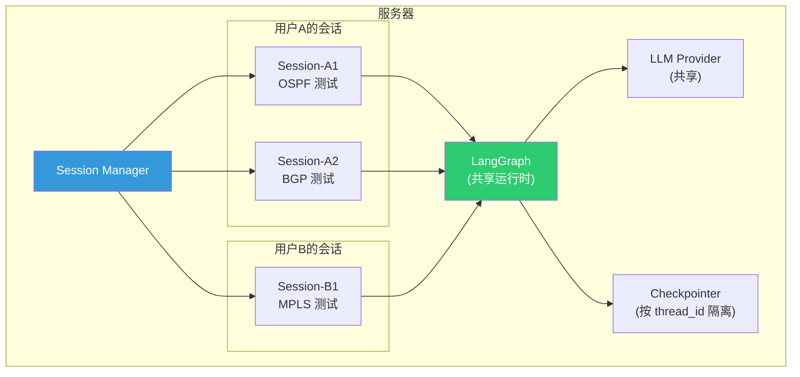
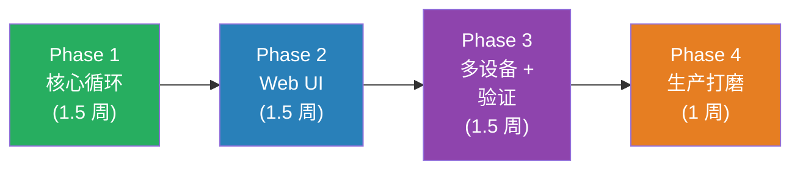

# Test Agent 架构方案 v2（修订版 · 下）

---

## 五、多用户会话管理

Claude Code 是单用户本地运行，而 Test Agent 是 **多用户服务器共享**，需要会话隔离：

```python
class SessionManager:
    """管理多用户的 Agent 会话"""

    def __init__(self, checkpointer, llm_provider):
        self.checkpointer = checkpointer
        self.llm_provider = llm_provider
        self._sessions: dict[str, AgentSession] = {}

    def get_or_create(self, session_id: str, user_id: str) -> AgentSession:
        if session_id not in self._sessions:
            self._sessions[session_id] = AgentSession(
                session_id=session_id,
                user_id=user_id,
                agent=build_test_agent(
                    llm_provider=self.llm_provider,
                    topology=self._load_user_topology(user_id),
                ),
                config={
                    "configurable": {
                        "thread_id": session_id,  # LangGraph 线程 ID
                    }
                },
            )
        return self._sessions[session_id]


class AgentSession:
    """单个用户会话"""
    session_id: str
    user_id: str
    agent: CompiledGraph  # LangGraph 编译后的 Agent
    config: dict  # LangGraph 运行配置
    created_at: datetime

    async def send_message(self, message: str) -> AsyncIterator[dict]:
        """发送消息并流式返回结果"""
        input_msg = {"messages": [{"role": "user", "content": message}]}
        async for chunk in self.agent.astream(input_msg, self.config):
            yield chunk
```

**会话隔离模型**：



- 每个会话有独立的 `thread_id`，LangGraph 的 checkpointer 自动按线程隔离状态
- LLM Provider 和设备连接池是 **全局共享** 的（节省资源）
- 切换 LLM Provider 时影响 **所有新请求**（已运行的不受影响）

---

## 六、项目目录结构

```
test-agent/
├── backend/                     # Python 后端
│   ├── main.py                  # FastAPI 入口
│   ├── config.yaml              # 全局配置（含 LLM 切换）
│   │
│   ├── agent/                   # Agent 引擎（核心）
│   │   ├── graph.py             # LangGraph 图定义
│   │   ├── nodes.py             # LLM 节点 + Tool 节点
│   │   ├── state.py             # Agent 状态定义
│   │   └── prompts.py           # 系统提示词
│   │
│   ├── llm/                     # LLM 提供商抽象层
│   │   ├── base.py              # LLMProvider 抽象接口
│   │   ├── internal.py          # 内部 LLM 实现
│   │   ├── anthropic.py         # Anthropic 实现
│   │   ├── openai.py            # OpenAI 实现
│   │   └── factory.py           # 工厂 + 一键切换
│   │
│   ├── tools/                   # 路由器工具
│   │   ├── base.py              # Tool 基类
│   │   ├── device_tool.py       # 设备命令执行
│   │   ├── topology_tool.py     # 拓扑查询
│   │   ├── verify_tool.py       # 断言验证
│   │   └── config_template.py   # 配置模板
│   │
│   ├── infra/                   # 基础设施
│   │   ├── device_connector.py  # 设备连接池
│   │   ├── topology_store.py    # 拓扑管理
│   │   └── session_manager.py   # 多用户会话
│   │
│   └── api/                     # API 路由
│       ├── chat.py              # WebSocket 对话
│       ├── sessions.py          # 会话管理
│       ├── topology.py          # 拓扑 CRUD
│       └── settings.py          # 设置（含 LLM 切换）
│
├── frontend/                    # Web 前端
│   ├── src/
│   │   ├── views/
│   │   │   ├── ChatView.vue     # 对话主界面
│   │   │   ├── TopologyView.vue # 拓扑管理
│   │   │   └── SettingsView.vue # 设置页（LLM 切换）
│   │   ├── components/
│   │   │   ├── MessageBubble.vue
│   │   │   ├── ToolResultCard.vue
│   │   │   └── TopologyGraph.vue
│   │   └── App.vue
│   └── package.json
│
├── topologies/                  # 拓扑定义文件
│   ├── ospf_basic.yaml
│   └── bgp_fullmesh.yaml
│
├── docker-compose.yaml          # 一键部署
└── README.md
```

**核心代码量估算**：

| 模块       | 预估行数         | 说明                          |
|----------|--------------|-----------------------------|
| `agent/` | ~300 行       | LangGraph 图 + 节点 + 状态 + 提示词 |
| `llm/`   | ~200 行       | 3 个 Provider + 工厂           |
| `tools/` | ~400 行       | 4 个路由器工具                    |
| `infra/` | ~300 行       | 连接池 + 拓扑 + 会话               |
| `api/`   | ~200 行       | FastAPI 路由                  |
| **后端总计** | **~1,400 行** | Claude Code 的 1/350         |
| 前端       | ~2,000 行     | Vue 页面 + 组件                 |
| **总计**   | **~3,400 行** | —                           |

---

## 七、修订后的实施路线



### Phase 1：核心循环（~1.5 周）

- [ ] LLM Provider 抽象层（`llm/`）— 3 个实现
- [ ] LangGraph Agent 图（`agent/`）— ReAct 循环
- [ ] DeviceTool + TopologyTool（`tools/`）
- [ ] 拓扑加载（YAML → TopologyGraph）
- [ ] CLI 验证：命令行跑通「单设备 OSPF 配置」

### Phase 2：Web UI（~1.5 周）

- [ ] FastAPI WebSocket 接口
- [ ] Session Manager 多用户会话
- [ ] Vue 前端：对话界面 + 工具结果展示
- [ ] 设置页面：LLM Provider 一键切换
- [ ] **里程碑**：浏览器中完成第一个路由器测试

### Phase 3：多设备 + 验证（~1.5 周）

- [ ] VerifyTool（带重试断言）
- [ ] LangGraph 子图（多设备协调）
- [ ] ConfigTemplateTool
- [ ] 拓扑管理界面
- [ ] LangGraph 检查点持久化

### Phase 4：生产打磨（~1 周）

- [ ] Docker Compose 部署
- [ ] 测试报告导出
- [ ] 错误处理 + 日志
- [ ] 基本用户认证

---

## 八、v1 → v2 变更总结

| 维度       | v1 方案            | v2 方案               | 变更理由             |
|----------|------------------|---------------------|------------------|
| 部署       | 本地 CLI           | **服务器 Web**         | 测试人员不装环境         |
| 前端       | 无                | **Vue 3 Web UI**    | 登录即用             |
| 后端框架     | asyncio 纯手写      | **FastAPI**         | WebSocket + REST |
| Agent 引擎 | 自建循环             | **LangGraph**       | 检查点/子图价值         |
| LLM 调用   | 固定 anthropic SDK | **Provider 抽象层**    | 内部/外部一键切换        |
| 多用户      | 不支持              | **Session Manager** | 多人共享服务器          |
| 代码量目标    | ~5,000 行         | **~3,400 行**        | 更多复用框架能力         |
| 交互方式     | Terminal         | **WebSocket 流式**    | 实时展示工具执行         |

---

## 九、最终技术栈

| 层次           | 技术                     | 版本     | 选择理由                    |
|--------------|------------------------|--------|-------------------------|
| **语言**       | Python                 | 3.11+  | 网络测试生态 + LangGraph 原生支持 |
| **Web 框架**   | FastAPI                | 0.100+ | 异步 + WebSocket + 自动文档   |
| **Agent 编排** | LangGraph              | 最新     | 状态图 + 检查点 + 子图          |
| **LLM (内部)** | httpx                  | —      | 直接调用内部 OpenAI 兼容 API    |
| **LLM (外部)** | anthropic / openai SDK | —      | 原生 SDK，按需安装             |
| **Schema**   | Pydantic v2            | —      | 工具输入验证                  |
| **设备连接**     | Netmiko / Scrapli      | —      | SSH/Telnet              |
| **前端**       | Vue 3 + Element Plus   | —      | 与部门技术栈统一                |
| **通信**       | WebSocket              | —      | 流式消息推送                  |
| **持久化**      | SQLite                 | —      | LangGraph checkpointer  |
| **部署**       | Docker Compose         | —      | 一键部署                    |

> [!TIP]
> **一句话总结 v2 的核心理念**：
>
> Test Agent = **FastAPI**（多用户接口）+ **LangGraph**（Agent 引擎）+ **Provider 层**（LLM 切换）+ **自定义 Tools**（路由器操作）+ **Vue 前端**（Web 交互）
>
> 不用 LangChain，不照搬 Claude Code 的复杂度。**3,400 行代码解决问题。**

---

## 十、待确认决策点

请在以下几点上给出你的想法：

1. **前端技术**：你们部门用的是 Vue 3 吗？还是其他前端框架？这决定前端选型
2. **内部 LLM 的 API 格式**：部门服务器的 LLM 推理服务是否兼容 OpenAI API 格式？（vLLM / TGI / Ollama 都兼容）如果是自定义格式，Provider 层需要适配
3. **设备连接方式**：你们现有系统（TTools）连接路由器用的是 SSH (Netmiko) 还是 Netconf？Test Agent 可以直接复用现有的连接基础设施
